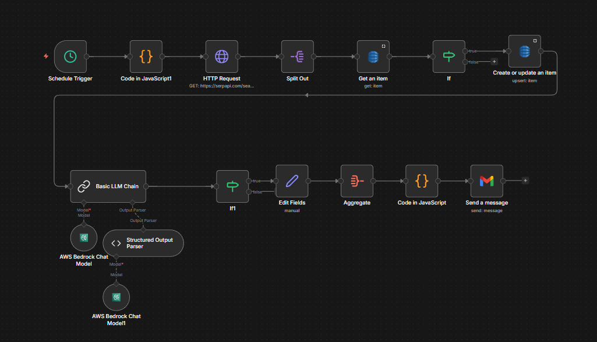
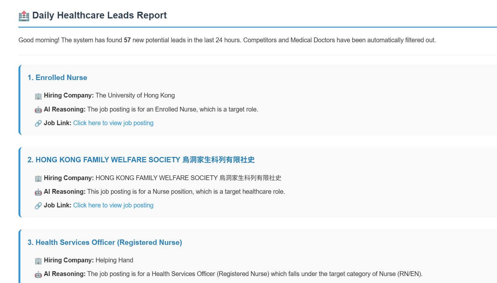

# Automated Competitor & Lead Filtering Report

## Overview

This n8n workflow automatically searches for healthcare-related job postings in Hong Kong, filters out irrelevant or duplicate jobs, uses AI to identify high-value target leads, and sends a daily HTML email report to the Client Origination (CO) team. It is designed to reduce manual prospecting work and help the team quickly identify organizations that may need staffing support.

The workflow focuses on target healthcare roles such as nurses, care workers, therapists, nutritionists, and social workers, while excluding non-target roles such as doctors, dentists, and administrative positions. It can also be configured to exclude known competitors by company name during the AI filtering step.

## Business Purpose

The main purpose of this workflow is to support business development and lead generation. When a healthcare organization posts a job opening for a target role, that company may be a potential client for staffing or recruitment services.

Instead of manually checking multiple job boards every day, the workflow automates the entire pipeline: search, deduplication, AI evaluation, filtering, and reporting. This helps the CO team focus only on actionable leads rather than spending time reviewing raw job listings.

## Workflow Logic

The workflow begins with a **Schedule Trigger**, which runs the automation on a recurring basis. A JavaScript code node then generates multiple predefined job-search queries covering three healthcare role clusters: nursing/caregiving, therapy roles, and speech/nutrition/social work roles, all limited to Hong Kong and paginated using `start` offsets.

The **HTTP Request** node calls the SerpApi endpoint with the `google_jobs` engine, English language, Hong Kong region, and a `date_posted:month` chip to retrieve recent job postings from Google Jobs. The workflow then uses **Split Out** to process each job result individually.

Next, the workflow checks AWS DynamoDB using the `job_id` field to determine whether a job has already been processed. If the job is new, it writes the record into the `ScrapedJobs` table so future runs can skip it.

The job is then sent to an **AWS Bedrock** model through the **Basic LLM Chain**, where AI analyzes whether the posting matches the target client profile. The AI is instructed to return structured JSON including `is_target`, `reason`, `company_name`, `title`, and `url`, and a **Structured Output Parser** is used to enforce that format.

After that, an **If** node keeps only items where `is_target = true`, and a **Set/Edit Fields** node extracts only the fields needed for reporting. The selected jobs are aggregated into a `job_list`, then a JavaScript code node builds a formatted HTML email showing the hiring company, AI reasoning, and job link for each lead. Finally, the Gmail node sends the daily report to the configured recipient.

## AWS Services Used

### 1. Amazon DynamoDB
This workflow uses **Amazon DynamoDB** as a lightweight deduplication database. The `Get an item` node checks whether a `job_id` already exists in the `ScrapedJobs` table, and the `Create or update an item` node stores newly processed jobs into the same table.

This prevents duplicate reporting and ensures that the CO team does not receive the same job lead repeatedly in future daily runs.

### 2. Amazon Bedrock
This workflow uses **Amazon Bedrock** as the AI inference layer through the `AWS Bedrock Chat Model` nodes. The configured model is `amazon.nova-lite-v1:0`, which is used to analyze job titles, company names, URLs, and descriptions to decide whether a job posting represents a target lead.

Bedrock allows the workflow to use managed foundation models without hosting any model infrastructure directly, which simplifies deployment and keeps the architecture serverless on the AI side.

## External Services Used

### SerpApi
The workflow uses **SerpApi** to query Google Jobs results through a standard HTTP Request node. It searches for recent Hong Kong healthcare-related jobs using predefined search strings and location/date filters.

### Gmail
The final report is sent using **Gmail OAuth** through n8n’s Gmail node. The email contains a human-readable HTML summary of all qualified leads found during that run.

## Search Coverage

The workflow currently searches three groups of roles:

- Nursing and caregiving: `Nurse`, `RN`, `EN`, `Health Caregiver`
- Therapy roles: `PCW`, `Physical Therapist`, `PT`, `OT`
- Other allied health roles: `Speech Therapist`, `Nutritionist`, `Social Worker`, `RSW`
For each group, it queries two result pages using `start = 0` and `start = 10`, which increases the breadth of job coverage per run.

## Output

The final output is a daily HTML email report titled **“Daily Healthcare Leads Report”**. Each entry in the report includes:

- Job title
- Hiring company
- AI reasoning for why the job is considered a target lead
- Clickable job posting link

Example of the email report:

This makes it easy for the CO team to review new leads and decide which organizations to contact.

## Example Use Case

If a rehabilitation center, home care provider, NGO, or hospital posts a job for an Enrolled Nurse, Physiotherapist, or Social Worker in Hong Kong, this workflow can identify that posting, verify it is not a duplicate, assess it with AI, and include it in the daily report sent to the business development team.

## Maintenance Notes

To keep this workflow accurate and useful over time, you should periodically review:

- The search queries in the initial JavaScript node
- The AI inclusion and exclusion criteria in the Basic LLM Chain prompt
- The list of competitor names used in the exclusion rule if competitor filtering is enabled
- The DynamoDB table contents and retention strategy
- The Gmail recipient and report format

## Summary

This workflow is a practical lead-generation automation for healthcare staffing and business development. It combines web search, AWS-based deduplication, AWS-based AI analysis, and email reporting into a single daily process that helps the CO team discover new potential client opportunities faster and with much less manual effort.
